# 12 — Diagrams (UML, DFD, Sequence)

*(Deliverables T, U, V)*

All diagrams are Mermaid so they render in GitHub, VS Code, and most report toolchains.

---

## T. UML

### T.1 Package / component diagram

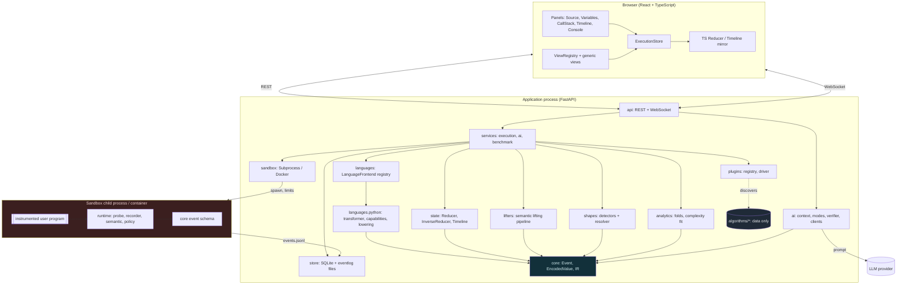

### T.2 Class diagram — event & state model

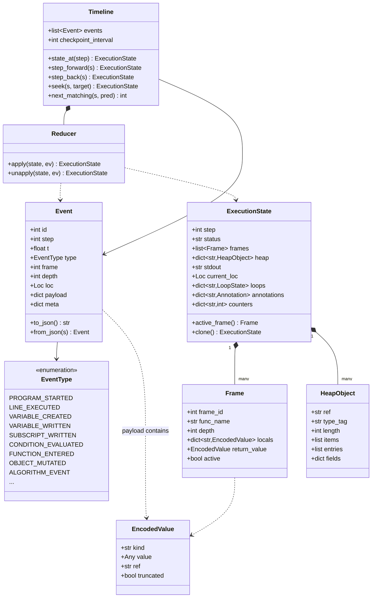

### T.3 Class diagram — extension points

```mermaid
classDiagram
    class LanguageFrontend {
        <<interface>>
        +str language_id
        +analyze(source) AnalysisResult
        +instrument(source, opts) InstrumentedProgram
        +runtime_bootstrap() str
    }
    class PythonFrontend
    class ShallowPythonFrontend
    class CppFrontend { <<future>> }
    LanguageFrontend <|.. PythonFrontend
    LanguageFrontend <|.. ShallowPythonFrontend
    LanguageFrontend <|.. CppFrontend

    class Sandbox {
        <<interface>>
        +run(job, policy) SandboxResult
    }
    class SubprocessSandbox
    class DockerSandbox
    Sandbox <|.. SubprocessSandbox
    Sandbox <|.. DockerSandbox

    class Lifter {
        <<interface>>
        +str id
        +int window
        +feed(ev, ctx) list~Event~
    }
    class SwapLifter
    class CompareLifter
    class RelaxLifter
    class StackQueueLifter
    Lifter <|.. SwapLifter
    Lifter <|.. CompareLifter
    Lifter <|.. RelaxLifter
    Lifter <|.. StackQueueLifter

    class ShapeDetector {
        <<interface>>
        +detect(obj, state) ShapeMatch
    }
    class AdjacencyMapDetector
    class ScalarArrayDetector
    class LinkedStructureDetector
    ShapeDetector <|.. AdjacencyMapDetector
    ShapeDetector <|.. ScalarArrayDetector
    ShapeDetector <|.. LinkedStructureDetector

    class LLMClient {
        <<interface>>
        +complete(system, user, max_tokens) LLMResponse
    }
    class AnthropicClient
    class TemplateExplainer
    class NullClient
    LLMClient <|.. AnthropicClient
    LLMClient <|.. TemplateExplainer
    LLMClient <|.. NullClient

    class AlgorithmPlugin {
        +str id
        +str name
        +str category
        +str entry
        +list~InputField~ inputs
        +Complexity complexity
        +list~VizHint~ viz_hints
        +list~str~ invariants
    }
    class PluginRegistry {
        +discover() list~AlgorithmPlugin~
        +validate(p) ValidationReport
        +get(id) AlgorithmPlugin
    }
    PluginRegistry o-- AlgorithmPlugin
```

### T.4 State machine — execution lifecycle

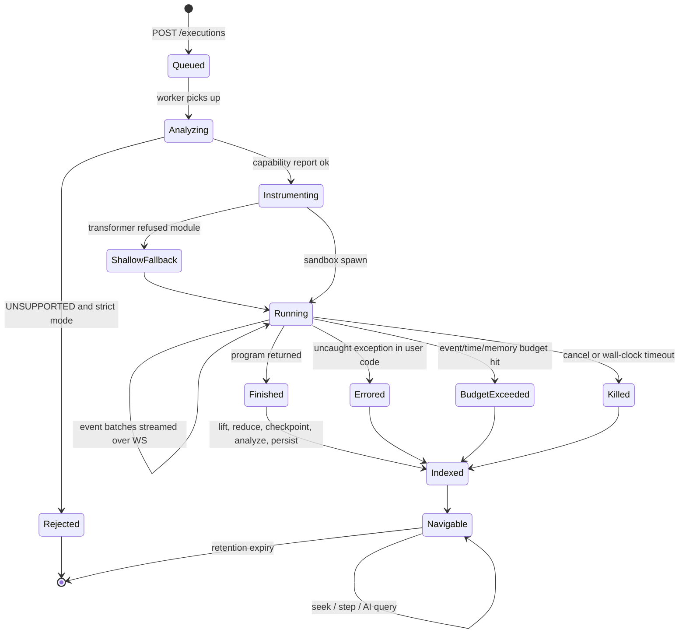

Note that `Errored` and `BudgetExceeded` both reach `Indexed`. A failed run is a
first-class, fully navigable artifact — that is the whole point.

### T.5 Use-case diagram

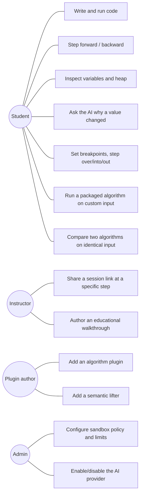

---

## U. Data-Flow Diagrams

### U.1 Level 0 — context

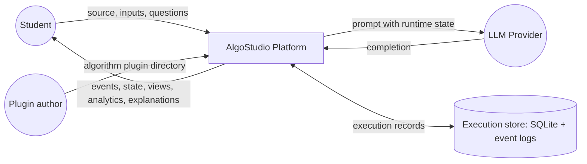

### U.2 Level 1 — main processes

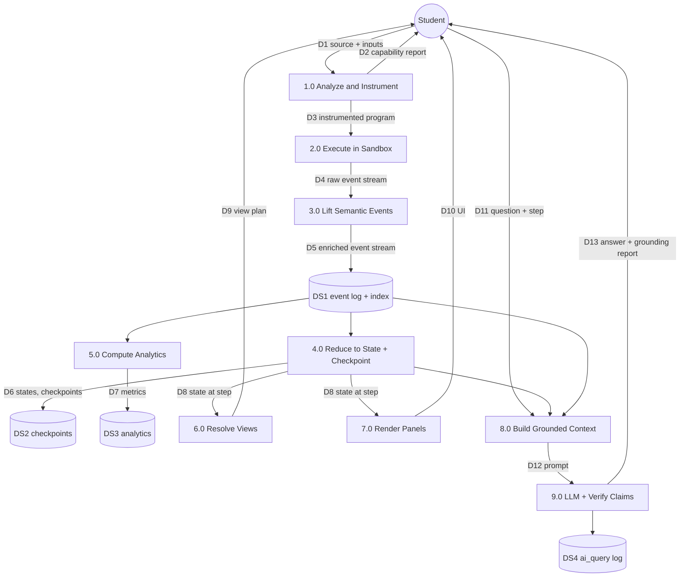

### U.3 Level 2 — process 1.0, Analyze and Instrument

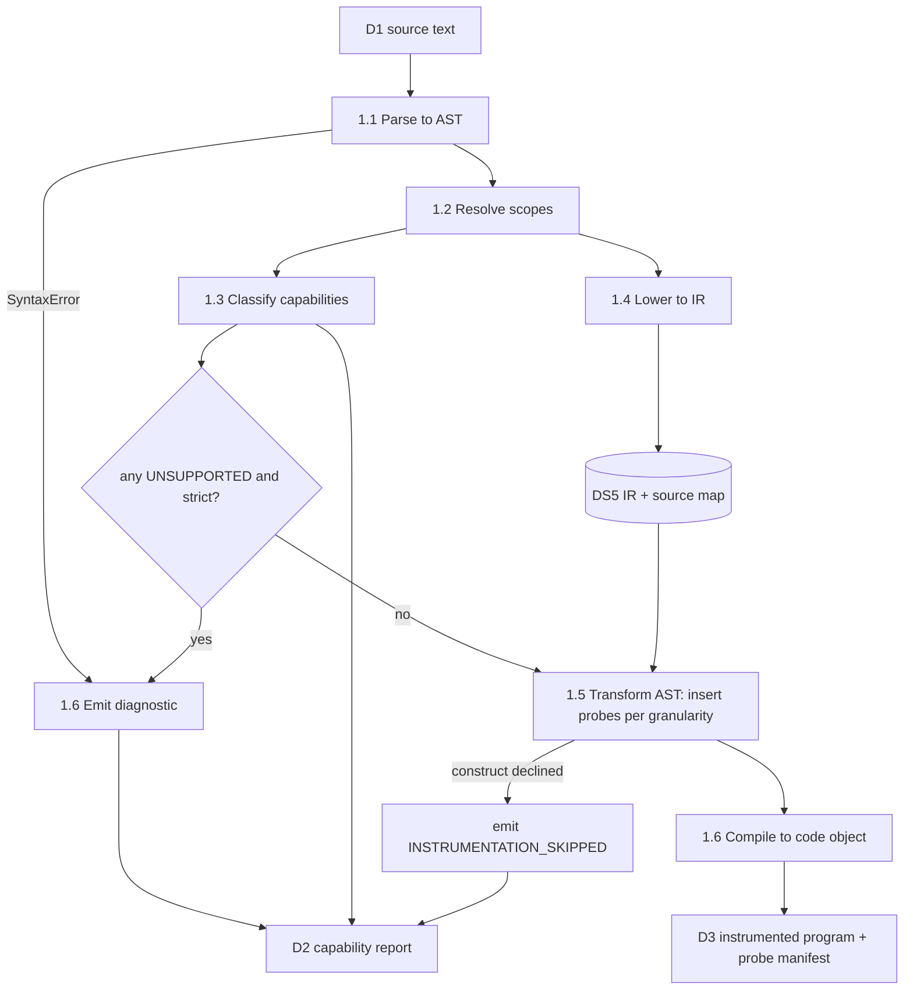

### U.4 Level 2 — process 2.0, Execute in Sandbox

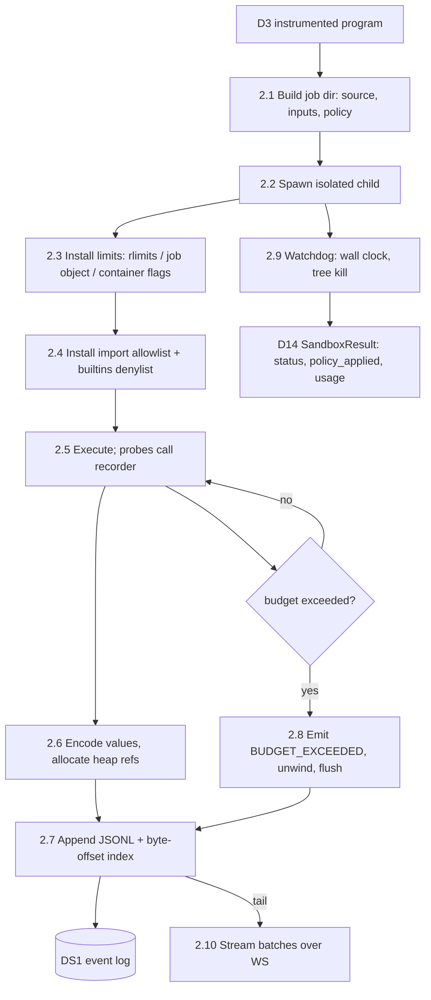

### U.5 Level 2 — process 6.0, Resolve Views

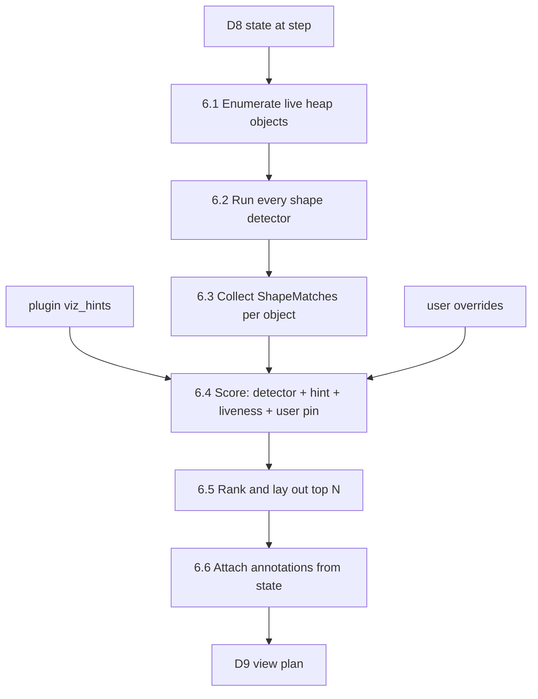

---

## V. Sequence Diagrams

### V.1 Run a program end to end

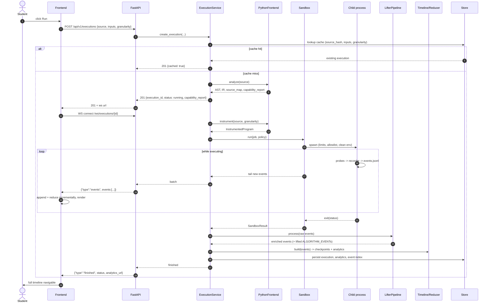

### V.2 Step backward (the O(1) path)

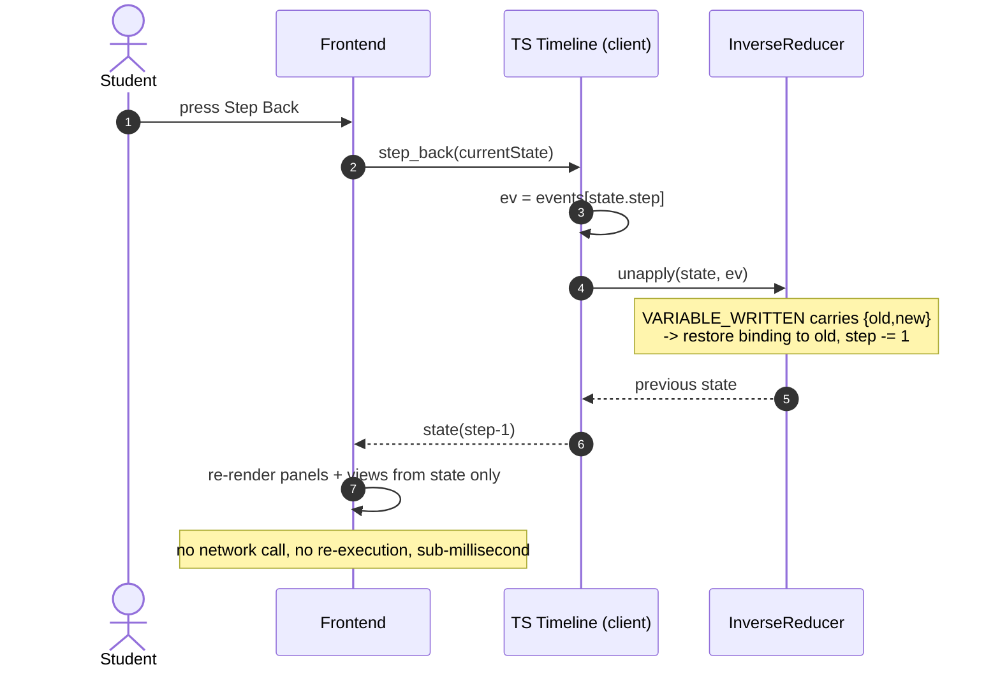

### V.3 Seek to an arbitrary step

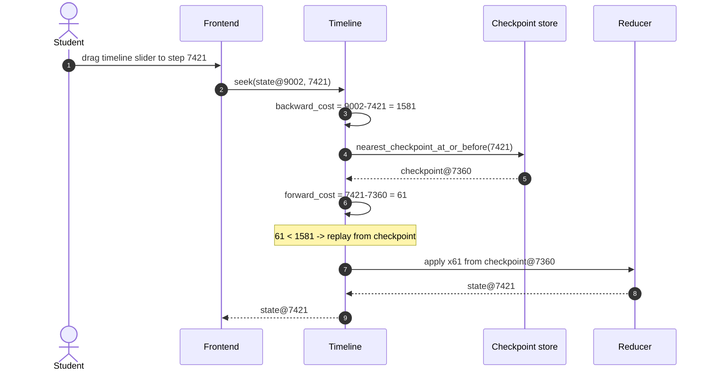

### V.4 Grounded AI explanation

```mermaid
sequenceDiagram
    autonumber
    actor U as Student
    participant FE as Frontend
    participant API as FastAPI
    participant CX as ContextBuilder
    participant TL as Timeline
    participant EL as EventLog
    participant LLM as LLMClient
    participant VF as ClaimVerifier
    participant DB as ai_query

    U->>FE: "Why did mid become 4?" at step 1423
    FE->>API: POST /executions/{id}/ai {step, mode: why_value, focus: mid}
    API->>DB: cache lookup (execution, step, mode, question)
    alt cached
        DB-->>API: prior answer
    else
        API->>CX: build(execution, step=1423, mode, focus="mid")
        CX->>TL: state_at(1423)
        CX->>EL: causal_chain("mid", 1423)
        EL-->>CX: write@41 <- reads low@37, high@12; expr (3+6)//2=4
        CX-->>API: AIContext (token-budgeted, truncation marked)
        API->>LLM: complete(system_rules, context + question)
        LLM-->>API: answer text
        API->>VF: verify(answer, state, analytics)
        VF-->>API: GroundingReport{verified:4, contradicted:0}
        opt contradicted > 0
            API->>LLM: regenerate with contradiction quoted
            LLM-->>API: revised answer
            API->>VF: verify again
        end
        API->>DB: persist query, answer, grounding, tokens
    end
    API-->>FE: {answer, grounding}
    FE->>U: answer with claim underlines + evidence links to events
```

### V.5 Adding a new algorithm (INV-1 in action)

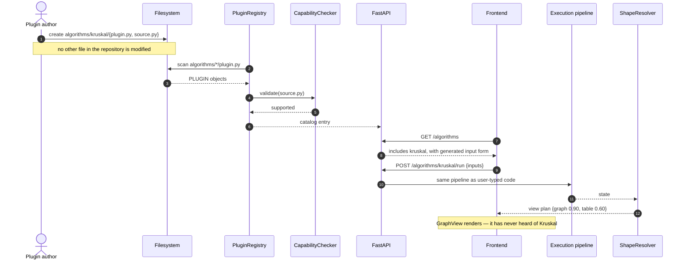

### V.6 Sandbox containment of a runaway program

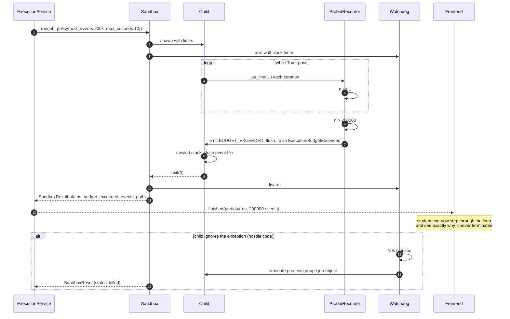

### V.7 Live WebSocket delivery with reconnect

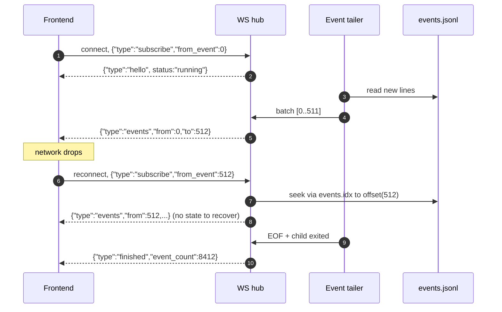
